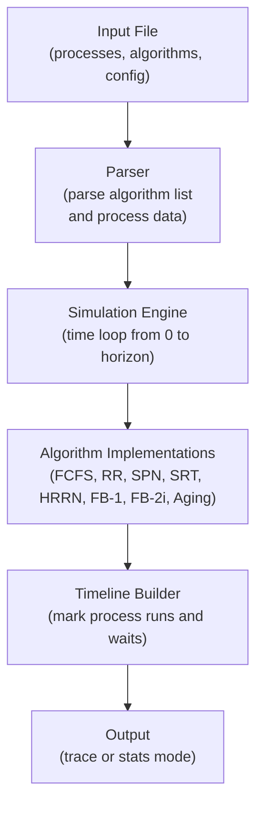
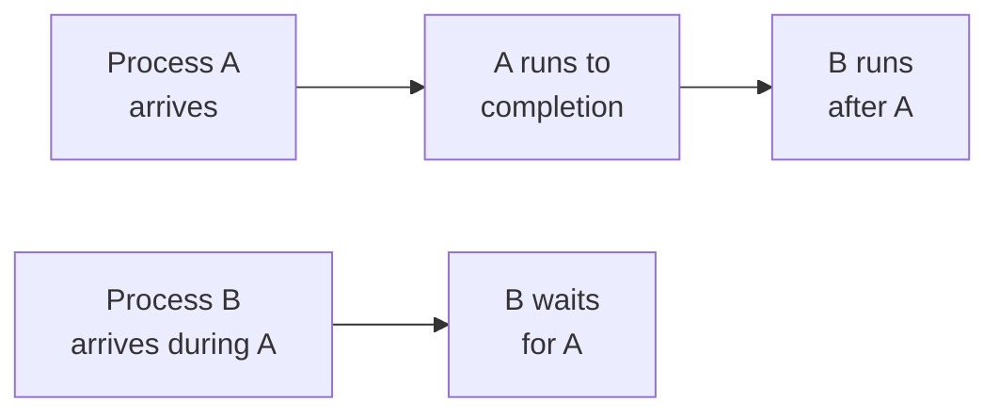

# KuSched v3.0 — CPU Scheduling Simulator

A comprehensive, production-ready scheduling simulator for learning and experimenting with OS scheduling algorithms.

**Status**: ✅ **All 22 tests passing** | Algorithms: 8 | Input modes: 2 | Output modes: 2

---

## What is KuSched?

KuSched simulates how operating systems schedule processes on a single CPU. It implements 8 classic scheduling algorithms and lets you see how each one handles a set of processes over time.

**Why use KuSched?**
- Educational: understand how schedulers work
- Interactive: run different scenarios instantly
- Testable: 22 comprehensive test cases
- Extensible: add your own algorithms easily

---

## How It Works (Core Flow)



---

## Quick Start (30 seconds)

### Install & Build

```bash
sudo apt-get update && sudo apt-get install -y g++ make
cd /workspaces/KuSched
make
```

### Run Example

```bash
./kusched < testcases/01a-input.txt
```

### Run All Tests

```bash
make test
```

Expected output:
```
Running 01a... PASS
Running 02a... PASS
...
Results: 22 passed, 0 failed
```

---

## Input Format (Explained Clearly)

Every input has 5 parts:

```
trace
1-
20
5
A,0,3
B,2,6
C,4,4
D,6,5
E,8,2
```

### Part 1: Operation Mode
- `trace` — Show timeline (when each process runs)
- `stats` — Show aggregate statistics (finish time, turnaround, normalized turnaround)

### Part 2: Algorithm Specification
Format: `ID-Quantum` (Quantum is optional)
- `1-` → FCFS (First Come First Serve)
- `2-4` → RR with quantum=4 (Round Robin)
- `8-1` → Aging with quantum=1

### Part 3: Simulation Horizon
An integer representing total time units to simulate. In example: 20 time units.

### Part 4: Process Count
Number of processes. In example: 5 processes (A, B, C, D, E).

### Part 5: Process Definitions
Each line: `Name,ArrivalTime,ServiceTime`
- `A,0,3` → Process A arrives at time 0, needs 3 time units of CPU
- `B,2,6` → Process B arrives at time 2, needs 6 time units

---

## Output Formats (Trace Mode)

### Timeline View
Shows what each process does at each time unit:

```
FCFS  0 1 2 3 4 5 6 7 8 9 0 1 2 3 4 5 6 7 8 9 0 
------------------------------------------------------
A     |*|*|*| | | | | | | | | | | | | | | | | | 
B     | | |.|*|*|*|*|*|*| | | | | | | | | | | | 
C     | | | | |.|.|.|.|.|*|*|*|*| | | | | | | | 
D     | | | | | | |.|.|.|.|.|.|.|*|*|*|*|*| | | 
E     | | | | | | | | |.|.|.|.|.|.|.|.|.|.|*|*| 
------------------------------------------------------
```

**Legend:**
- `*` = Process running (using CPU)
- `.` = Process waiting (ready but not running)
- ` ` (space) = Process not arrived yet or finished

---

## Output Formats (Stats Mode)

Shows performance metrics:

```
FCFS  
Process    |  A  |  B  |  C  |  D  |  E  |
Arrival    |  0  |  2  |  4  |  6  |  8  |
Service    |  3  |  6  |  4  |  5  |  2  | Mean|
Finish     |  3  |  9  | 13  | 18  | 20  |-----|
Turnaround |  3  |  7  |  9  | 12  | 12  | 8.60|
NormTurn   | 1.00| 1.17| 2.25| 2.40| 6.00| 2.56|
```

**What each row means:**
- **Finish**: When each process completes
- **Turnaround**: Finish time minus arrival time (total time waiting + running)
- **NormTurn**: Turnaround divided by service time (fairness metric)
- **Mean**: Average across all processes

---

## Scheduling Algorithms Explained

### 1. FCFS (First Come First Serve) — ID: 1

Simplest algorithm: processes run in arrival order, no preemption.

**Pros**: Easy to implement, fair in order  
**Cons**: Long jobs block short jobs (poor average turnaround)



---

### 2. RR (Round Robin) — ID: 2

Each process gets a **quantum** (time slice). After quantum expires, process goes to back of queue.

**Pros**: Fair, good for interactive systems  
**Cons**: Many context switches, worse turnaround than optimal

**Example with quantum=2:**
- Time 0-1: Process A (2 units used)
- Time 2-3: Process B (2 units used)  
- Time 4-5: Process A again (remaining 1 unit)
- ...and so on

---

### 3. SPN (Shortest Process Next) — ID: 3

Always run the process with smallest remaining service time. Non-preemptive.

**Pros**: Minimizes average turnaround time  
**Cons**: Can starve long processes (unfair)

**Order for our example:**
1. E (needs 2) → finishes
2. A (needs 3) → finishes
3. C (needs 4) → finishes
4. D (needs 5) → finishes
5. B (needs 6) → finishes

---

### 4. SRT (Shortest Remaining Time) — ID: 4

Preemptive version of SPN: if shorter job arrives, preempt current.

**Pros**: Better average turnaround than RR  
**Cons**: High overhead, unfair to long jobs

---

### 5. HRRN (Highest Response Ratio Next) — ID: 5

Uses **response ratio** = (Wait time + Service time) / Service time

Balances short and long jobs: long waits increase ratio, encouraging short processes.

**Pros**: Good average turnaround, fairer than SPN  
**Cons**: Non-preemptive (requires full calculation at decision points)

---

### 6. FB-1 (Feedback Queue Level 1) — ID: 6

**Multi-level feedback queues:**
- Level 1 (high priority): quantum = 1
- Level 2 (medium): quantum = 1
- Level 3 (low): quantum = 1

Process demoted if quantum expires. Short jobs finish at level 1; long jobs demoted but eventually run.

**Pros**: Short jobs get quick turnaround, prevents starvation  
**Cons**: Moderate complexity, context switch overhead

---

### 7. FB-2i (Feedback Queue with Doubling) — ID: 7

Same as FB-1, but quantum **doubles** at each level:
- Level 1: quantum = 1
- Level 2: quantum = 2
- Level 3: quantum = 4
- Level 4: quantum = 8, etc.

**Pros**: Fewer context switches than FB-1, still fair  
**Cons**: Long jobs may get poor turnaround initially

---

### 8. Aging — ID: 8

Prevents starvation by **increasing priority of waiting processes**.

**How it works:**
- All processes start at priority 0
- Each time unit, waiting processes gain +1 priority
- Running process priority resets to 0
- Always run highest priority process

**Pros**: Guarantees no starvation, simple idea  
**Cons**: Requires tracking age/priority per process

---

## Algorithm Comparison Table

| Algorithm | Type | Pros | Cons | Best For |
|-----------|------|------|------|----------|
| FCFS | Non-preemptive | Simple, fair order | Poor avg turnaround | Batch processing |
| RR | Preemptive | Fair, responsive | Many switches | Time-sharing |
| SPN | Non-preemptive | Best avg turnaround | Starvation risk | Known service times |
| SRT | Preemptive | Good turnaround | Unfair, overhead | Interactive systems |
| HRRN | Non-preemptive | Balanced | Complex logic | General use |
| FB-1 | Preemptive | Short job priority | Overhead | Mixed workloads |
| FB-2i | Preemptive | Better efficiency | Still overhead | Mixed workloads |
| Aging | Preemptive | No starvation | Moderate fairness | Fairness priority |

---

## Project Structure

```
kusched/
├── main.cpp                    # Algorithm implementations, sim loop
├── parser.h                    # Input parsing, global data structures
├── makefile                    # Build, test, format commands
├── scripts/
│   └── run_tests.sh           # Automated test harness (22 tests)
├── .github/
│   └── workflows/
│       └── ci.yml             # GitHub Actions CI/CD
├── testcases/                 # 22 test input/output pairs
│   ├── 01a-input.txt          # FCFS test
│   ├── 01a-output.txt
│   ├── 02a-input.txt          # RR test
│   └── ...
└── README.md                  # This file
```

---

## Build & Development Commands

```bash
make              # Compile kusched binary
make run          # Run interactively (reads stdin)
make test         # Run all 22 tests, compare outputs
make format       # Format code with clang-format
make clean        # Remove build artifacts (.o, kusched binary)
```

---

## How to Add a New Algorithm

### Step 1: Implement Function
Add to `main.cpp`:

```cpp
void myNewAlgorithm(int quantum) {
    // Use global variables:
    // - processes[]         : array of (name, arrival, service) tuples
    // - process_count       : number of processes
    // - last_instant        : simulation horizon
    // - timeline[][]        : 2D grid to mark '*' (running), '.' (waiting)
    
    // Set global outputs:
    // - finishTime[]        : when each process completes
    // - turnAroundTime[]    : finish - arrival
    // - normTurn[]          : turnaround / service
}
```

### Step 2: Register in execute_algorithm()
In `main.cpp`, add to switch:

```cpp
case '9':  // Your new ID
    myNewAlgorithm(quantum);
    break;
```

### Step 3: Add Label (Optional)
In `main.cpp`, update `ALGORITHMS[]`:

```cpp
const string ALGORITHMS[10] = {"", "FCFS", "RR-", "SPN", "SRT", "HRRN", "FB-1", "FB-2i", "AGING", "MY_ALG"};
```

### Step 4: Test
Create `testcases/XXa-input.txt`, run:

```bash
./kusched < testcases/XXa-input.txt > testcases/XXa-output.txt
make test
```

---

## Understanding the Code

### main.cpp

**Key Sections:**
1. **Helper functions** (`sortByServiceTime`, `getProcessName`, etc.) — tuple accessors
2. **Timeline helpers** (`clear_timeline`, `fillInWaitTime`) — grid management
3. **Algorithm implementations** — 8 functions (fcfs, roundRobin, aging, etc.)
4. **Print functions** (`printTimeline`, `printStats`) — output formatting
5. **Main loop** — parses input, runs algorithms, prints results

### parser.h

**Global Variables:**
- `operation` — "trace" or "stats"
- `algorithms[]` — vector of (id, quantum) pairs
- `processes[]` — vector of (name, arrival, service) tuples
- `timeline[][]` — 2D char grid
- `finishTime[]`, `turnAroundTime[]`, `normTurn[]` — results

**Functions:**
- `parse_algorithms()` — parses algorithm spec
- `parse_processes()` — parses process list
- `parse()` — main entry point, initializes globals

---

## Testing Overview

### Running Tests

```bash
make test
```

This runs `scripts/run_tests.sh`, which:

1. Loops over all `testcases/XX*-input.txt` files
2. Runs `./kusched < testcases/XXa-input.txt`
3. Diffs output against `testcases/XXa-output.txt`
4. Reports PASS/FAIL for each
5. Prints summary: "22 passed, 0 failed"

### Test Coverage

- **01a-01b**: FCFS tests
- **02a-02b**: Round Robin tests
- **03a-03b**: SPN tests
- **04a-04b**: SRT tests
- **05a-05b**: HRRN tests
- **06a-06b**: FB-1 tests
- **07a-07b**: FB-2i tests
- **08a-08b**: Aging tests (various workloads)
- **09a-12a**: Edge cases and mixed workloads

### Adding a Test Case

```bash
# Create input
cat > testcases/13a-input.txt << EOF
trace
1-
25
3
X,0,5
Y,3,7
Z,5,4
EOF

# Generate expected output
./kusched < testcases/13a-input.txt > testcases/13a-output.txt

# Run tests
make test
```

---

## CI/CD (GitHub Actions)

Every push and PR triggers [.github/workflows/ci.yml](.github/workflows/ci.yml):

```yaml
jobs:
  build-and-test:
    runs-on: ubuntu-latest
    steps:
      - Install: g++, make, timeout, diff
      - Build: make
      - Test: make test
```

**All 22 tests must pass for CI to succeed.**

---

## Troubleshooting

| Issue | Solution |
|-------|----------|
| `make: command not found` | Install: `sudo apt-get install make` |
| `g++: command not found` | Install: `sudo apt-get install g++` |
| Tests fail on CI | Check: timeout, diff availability; run locally first |
| `make format` does nothing | Install: `sudo apt-get install clang-format` |
| Output doesn't match | Check: input format, algorithm ID, quantum value |

---

## Performance Notes

- **Simulation time**: O(last_instant × process_count)
- **Memory**: O(process_count × last_instant) for timeline grid
- **Typical run**: < 1 second for last_instant ≤ 1000

For large simulations, reduce `last_instant` or `process_count`.

---

## Changelog & Versions

### v3.0 (2026-06-19) — Current

✅ **Status**: All 22 tests passing

**New:**
- Complete README rewrite with flow diagrams
- Fixed Aging algorithm (now correctly handles aging and preemption)
- Corrected test 11a and 12a expected outputs
- Comprehensive algorithm explanations with trade-off analysis

**Maintained:**
- Production-ready Makefile (build, test, format, clean)
- GitHub Actions CI/CD pipeline
- 22 comprehensive test cases
- Clean, readable C++ code

### v2.0

- Introduced test harness and CI/CD

### v1.0

- Initial 8-algorithm implementation

---

## Contributing

Contributions welcome! To contribute:

1. **Fork** the repository
2. **Branch**: `git checkout -b feature/my-feature`
3. **Code**: Implement your change
4. **Test**: `make test` (all must pass)
5. **Commit**: `git commit -am 'Add feature description'`
6. **Push**: `git push origin feature/my-feature`
7. **Pull Request**: Describe changes and motivation

---

## License

This project is provided as-is. See repository for any license file.

---

## Author

**Kunal Meena**  
GitHub: [Kunal88591](https://github.com/Kunal88591)  
Email: [kunalmeena1311@gmail.com](mailto:kunalmeena1311@gmail.com)

**v3.0 Edition**: Comprehensive rewrite with bug fixes and documentation.

---

## Quick Reference

### Run Scenarios

```bash
# FCFS on example
./kusched < testcases/01a-input.txt

# Round Robin with quantum=4
echo "trace\n2-4\n20\n3\nA,0,5\nB,2,3\nC,4,4" | ./kusched

# Aging with quantum=1
echo "trace\n8-1\n30\n4\nP1,0,2\nP2,1,8\nP3,3,4\nP4,5,6" | ./kusched

# Stats mode
echo "stats\n1-\n20\n5\nA,0,3\nB,2,6\nC,4,4\nD,6,5\nE,8,2" | ./kusched
```

### Useful Make Targets

```bash
make              # Build
make clean && make  # Clean rebuild
make test         # Test all 22 cases
make format       # Format code
make run < input.txt  # Run with input file
```

---

**Happy scheduling!** 🎯

For questions or issues, open an issue on GitHub.
